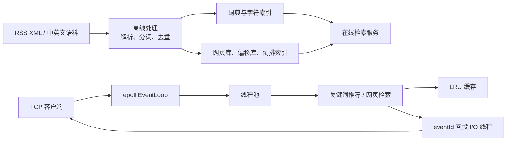

# 离线建库与在线推荐搜索引擎

基于 C++11 实现的本地搜索引擎，采用“离线建库 + 在线检索”架构。离线程序从 RSS 语料中生成词典、网页库、偏移库和倒排索引；在线程序加载这些数据，通过 TCP 协议提供关键词推荐、网页检索和分页浏览。

> 运行环境为 Linux。在线服务依赖 `epoll`、`eventfd` 和 `timerfd`，不支持直接在 macOS 或 Windows 上运行。

## 功能概览

- 解析 RSS XML 中的标题、链接和描述，清洗 HTML 标签。
- 使用 cppjieba 分词，使用 SimHash 和海明距离进行近似网页去重。
- 使用 TF-IDF 构建并持久化网页倒排索引；在线使用余弦相似度完成相关性排序。
- 基于字符倒排索引、UTF-8 最小编辑距离、词频和字典序完成中英文关键词推荐。
- 使用 `epoll` Reactor 管理 TCP 连接，线程池执行检索任务，`eventfd` 将结果投递回 I/O 线程。
- 使用 LRU 缓存热点查询；`timerfd` 周期性合并子缓存的更新记录；使用 log4cpp 记录服务日志。

## 架构



### 离线建库

| 模块     | 输入               | 处理                                           | 输出                                            |
| -------- | ------------------ | ---------------------------------------------- | ----------------------------------------------- |
| 词典构建 | 中文文章、英文文本 | cppjieba 分词、词频统计、字符索引              | `dict.dat`、`index.dat`、`idMap.dat`            |
| 网页建库 | RSS XML 文件       | XML 解析、HTML 清洗、SimHash 去重、TF-IDF 计算 | `ripepage.dat`、`offset.dat`、`invertIndex.dat` |

当前仓库中已提供一份生成好的数据集：约 3,901 篇网页文档、47,601 行词典数据和 81,720 行网页倒排索引数据。

### 在线查询流程

1. `EventLoop` 通过 `epoll` 接收连接和读事件。
2. 收到请求后，将关键词推荐或网页检索任务放入有界线程池队列。
3. 工作线程优先查询本地 LRU 缓存；未命中时访问内存中的词典或倒排索引。
4. 工作线程通过 `eventfd` 唤醒事件循环，由 I/O 线程发送查询结果。
5. `timerfd` 定期合并子缓存的待更新数据，并同步缓存副本。

## 目录结构

```text
.
├── offline/
│   ├── word/                 # 中英文词典与字符索引构建
│   │   ├── data/             # 原始语料及生成的 dict/index/idMap 数据
│   │   └── src/
│   └── page/                 # RSS 网页库、偏移库与倒排索引构建
│       ├── data/xml/         # RSS XML 语料
│       ├── data/*.dat        # 生成的网页库、偏移库、倒排索引
│       └── src/
└── online/                   # TCP 在线检索服务
    ├── conf/server.conf      # IP、端口、线程数及数据文件路径
    ├── include/              # Reactor、缓存、检索等模块头文件
    └── src/                  # 服务入口与实现
```

## 依赖

| 依赖                        | 用途                 | 说明                         |
| --------------------------- | -------------------- | ---------------------------- |
| GCC / Clang（支持 C++11）   | 编译器               | 项目 CMake 配置使用 C++11    |
| CMake ≥ 3.10                | 构建                 | 离线、在线模块均使用 CMake   |
| log4cpp                     | 日志                 | 在线服务需要链接 `log4cpp`   |
| nlohmann/json               | JSON 头文件          | 在线网页查询模块包含该头文件 |
| cppjieba、TinyXML2、SimHash | 分词、XML 解析、去重 | 源码或头文件随仓库提供       |

Ubuntu / Debian 可先安装基础依赖：

```bash
sudo apt update
sudo apt install build-essential cmake liblog4cpp5-dev nlohmann-json3-dev
```

## 构建与运行

### 启动在线服务

在线服务会读取 `online/conf/server.conf`，其中的数据文件路径是相对 `online/` 目录配置的。因此请在 `online/` 目录中构建和运行：

```bash
cd online
cmake -S . -B build
cmake --build build -j
./bin/SearchEngine
```

默认监听地址为 `127.0.0.1:8888`。启动前请确认以下离线数据文件存在：

```text
offline/word/data/dict.dat
offline/word/data/index.dat
offline/word/data/idMap.dat
offline/page/data/ripepage.dat
offline/page/data/offset.dat
offline/page/data/invertIndex.dat
```

### 连接服务并发送请求

可使用 `nc` 进行手工验证；每条命令以换行结尾：

```bash
nc 127.0.0.1 8888
```

| 请求       | 含义                              |
| ---------- | --------------------------------- |
| `1 查询词` | 查询关键词推荐，例如 `1 人工智能` |
| `2 查询词` | 查询网页，例如 `2 人工智能`       |
| `3`        | 下一页                            |
| `4`        | 上一页                            |
| `5`        | 首页                              |
| `6`        | 尾页                              |

### 重新生成词典数据

词典构建程序会读取 `offline/word/data/CN/art` 和 `offline/word/data/EN/english.txt`，并覆盖写入词典相关 `.dat` 文件：

```bash
cd offline/word
cmake -S . -B build
cmake --build build -j
./bin/word
```

## 配置说明

`online/conf/server.conf`：

| 配置项                   | 含义                                         |
| ------------------------ | -------------------------------------------- |
| `ip`、`port`             | 服务监听地址和端口                           |
| `threadNum`              | 工作线程数                                   |
| `queSize`                | 有界任务队列容量                             |
| `dict`、`index`、`idMap` | 关键词推荐词典与索引路径                     |
| `cachePath`              | 缓存文件路径；当前实现未将缓存持久化到该路径 |

## 已知限制

- TCP 是字节流，但当前协议解析以“一次读取一条文本命令”为前提，未实现长度字段或分隔符缓冲区来处理完整的粘包、拆包场景；生产环境应设计明确的应用层消息边界。
- 当前在线 `CMakeLists.txt` 将 `log4cpp` 头文件和库目录写为特定 Linux 路径，其他发行版需要按本机安装路径调整。
- `offline/page` 的源码当前引用 `DictProducer.h`，但该头文件未随该目录提供；重新构建网页库前需要补齐或重构该依赖。仓库已包含可供在线服务加载的网页库与索引数据。
- 结果分页状态以客户端 IP 和端口作为键保存在内存中，服务重启后不会保留。
- LRU 缓存用于降低重复查询的计算开销；其容量和同步周期目前为代码中的固定配置，尚未形成完整的持久化与动态配置能力。

## 后续改进方向

- 定义带长度字段的请求/响应协议，并为连接维护接收缓冲区。
- 使用 RAII、智能指针和标准 C++ 容器进一步统一资源管理，补齐系统调用错误处理。
- 为词典、检索、缓存和分页逻辑编写单元测试；通过 Sanitizer 和多客户端压测验证内存安全与并发稳定性。
- 将索引加载、缓存容量、同步周期等参数统一纳入配置，并补充缓存持久化。